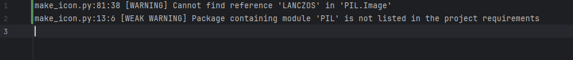
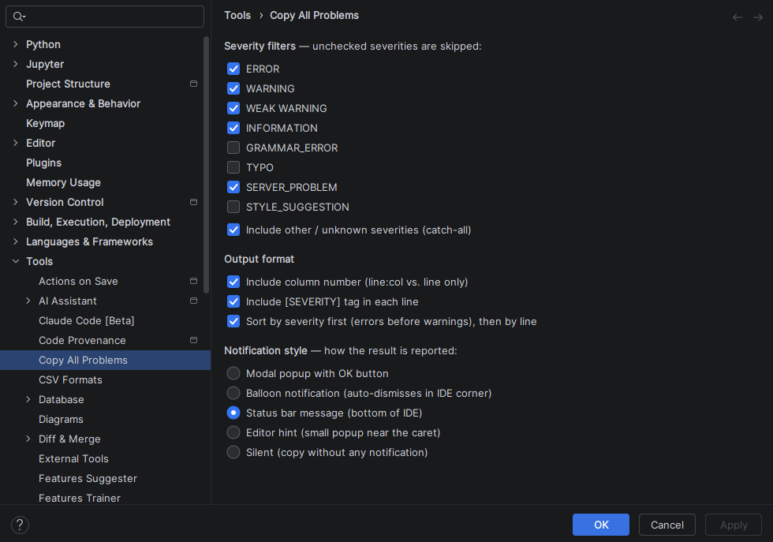
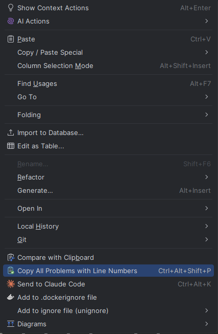

<p align="center">
  
</p>

# Copy All Problems — IntelliJ Platform Plugin

> A tiny plugin that adds an action to copy every diagnostic for the currently active file to the clipboard, with file path, line, column, severity, and description — one entry per line.

Works in any IntelliJ-platform IDE: IntelliJ IDEA, PyCharm (Community and Professional), WebStorm, GoLand, RubyMine, CLion, etc.

**Install from JetBrains Marketplace:**
[plugins.jetbrains.com/plugin/31816-copy-all-problems](https://plugins.jetbrains.com/plugin/31816-copy-all-problems)

[](https://plugins.jetbrains.com/plugin/31816-copy-all-problems)
[](https://plugins.jetbrains.com/plugin/31816-copy-all-problems)

## Output format

```
beszel.py:42:5 [WARNING] Unresolved reference 'foo'
beszel.py:87:12 [ERROR] Expected type 'int', got 'str' instead
beszel.py:103:1 [WEAK_WARNING] Function 'bar' may be 'static'
```



## Settings

**Settings → Tools → Copy All Problems** — three groups of options:

- **Severity filters** — toggle which severities are included (ERROR, WARNING,
  WEAK WARNING, INFORMATION, GRAMMAR_ERROR, TYPO, SERVER_PROBLEM,
  STYLE_SUGGESTION), plus a catch-all for any future or custom severity.
- **Output format** — include the column number, include the `[SEVERITY]` tag,
  and/or sort by severity (errors first) before line.
- **Notification style** — how the result is reported after the action runs:
  modal popup with OK (default), balloon notification (auto-dismisses in the
  IDE corner), editor hint near the caret, or silent (no notification at all).



## How to use

After installing the plugin (see below):

1. Open the file you want to inspect.
2. Wait a beat for the analyzer to finish (watch the bottom status bar — when
   "Analyzing…" disappears, you're good).
3. Either:
    - Right-click anywhere in the editor → **Copy All Problems with Line Numbers**
    - Or press **Ctrl+Shift+Alt+P** (Windows/Linux) / **⌘+Shift+Alt+P** (Mac)
    - Or **Tools → Copy All Problems with Line Numbers**
4. A balloon notification confirms how many problems were copied.
5. Paste anywhere.



## Build from source

You need a JDK 17+ on your PATH.

```bash
# From the project root:
./gradlew buildPlugin           # macOS / Linux
gradlew.bat buildPlugin         # Windows
```

The plugin zip will appear at:

```
build/distributions/copy-problems-1.0.0.zip
```

## Install in your IDE

**Option A — From JetBrains Marketplace (recommended):**

1. **Settings / Preferences → Plugins → Marketplace**.
2. Search for **Copy All Problems**.
3. Click **Install**, then **Restart IDE** when prompted.

Or open the [marketplace page](https://plugins.jetbrains.com/plugin/31816-copy-all-problems) directly and use the **Install to IDE** button.

**Option B — From a local zip (e.g. a build from source):**

1. **Settings / Preferences → Plugins**.
2. Click the gear icon (⚙) at the top → **Install Plugin from Disk…**
3. Select the zip from `dist/`.
4. Click **OK**, then **Restart IDE** when prompted.

## Uninstall

**Settings → Plugins → Installed**, find "Copy All Problems", click the gear
icon next to it → **Uninstall** → restart.

## How it works

The plugin uses `DaemonCodeAnalyzerEx.processHighlights(document, project,
null, 0, document.textLength, processor)` — the same engine that powers the
Problems tool window — to read every highlight currently computed for the
document. The call is wrapped in a read action. The collected highlights are
filtered (drop entries without a description and pure visual annotations),
sorted by offset (or by severity then offset, per settings), and written as:

```
<filename>:<line>:<col> [<severity>] <description>
```

to the system clipboard via `CopyPasteManager`.

If a future IntelliJ release breaks the `DaemonCodeAnalyzerEx` signature, the
action catches the error and shows it in a dialog instead of failing silently.

## Files

```
copy-problems-plugin/
├── build.gradle.kts                                    # Gradle build script
├── settings.gradle.kts                                 # Gradle settings
├── gradle.properties                                   # Gradle properties
├── gradlew, gradlew.bat                                # Gradle wrapper scripts
├── gradle/wrapper/gradle-wrapper.properties            # Wrapper config
├── src/main/
│   ├── kotlin/com/moraouf/copyproblems/
│   │   └── CopyProblemsAction.kt                       # The action
│   └── resources/META-INF/
│       └── plugin.xml                                  # Plugin descriptor
└── README.md                                           # This file
```

## License

[MIT](LICENSE) © Mohamed Abdelraouf
