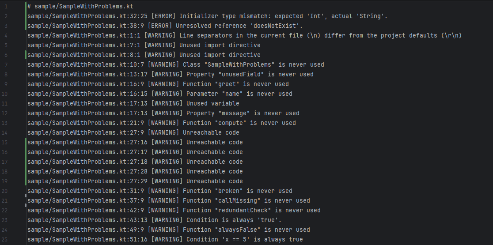
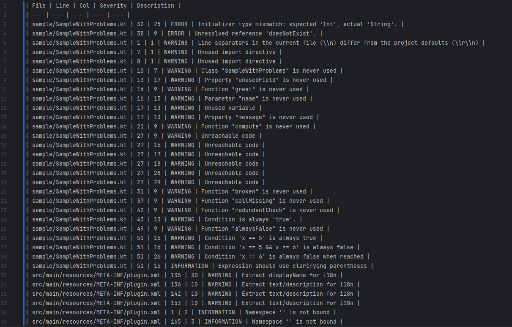
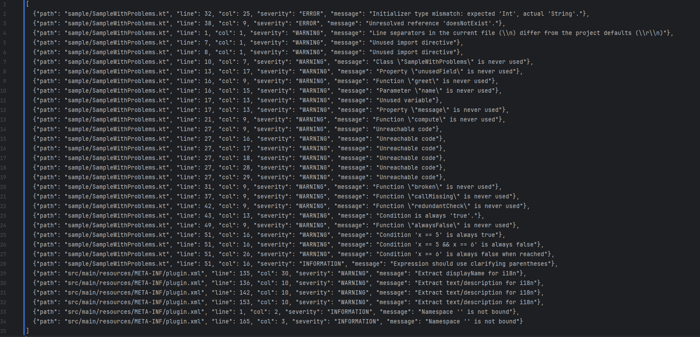
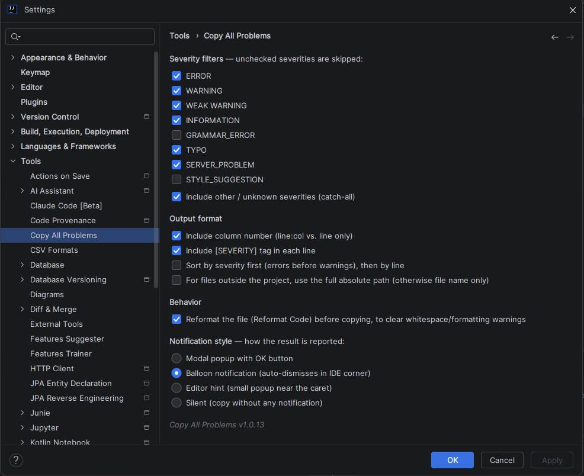
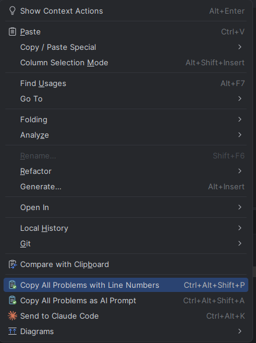

<p align="center">
  
</p>

# Copy All Problems — IntelliJ Platform Plugin

> A tiny plugin that adds an action to copy every diagnostic for the currently active file to the clipboard, with file path, line, column, severity, and description — one entry per line.

Works in any IntelliJ-platform IDE: IntelliJ IDEA, PyCharm (Community and Professional), WebStorm, GoLand, RubyMine, CLion, etc.

**Compatibility:** IntelliJ Platform **2022.2 through 2026.1** (builds `222`–`261.*`). The plugin ships as Java 17 bytecode, so a single build runs on every IDE in that range.

**Install from JetBrains Marketplace:**
[plugins.jetbrains.com/plugin/31816-copy-all-problems](https://plugins.jetbrains.com/plugin/31816-copy-all-problems)

[](https://plugins.jetbrains.com/plugin/31816-copy-all-problems)
[](https://plugins.jetbrains.com/plugin/31816-copy-all-problems)

## Output format

```
sample/SampleWithProblems.kt:7:1 [WARNING] Unused import directive
sample/SampleWithProblems.kt:10:7 [WARNING] Class "SampleWithProblems" is never used
sample/SampleWithProblems.kt:13:17 [WARNING] Property "unusedField" is never used
```



When the scope covers more than one file (open editors, VCS-changed, or a
directory), the plain output is grouped per file under a `# path` header:

```
# src/main/kotlin/Foo.kt
src/main/kotlin/Foo.kt:7:1 [WARNING] Unused import directive

# src/main/kotlin/Bar.kt
src/main/kotlin/Bar.kt:3:5 [ERROR] Unresolved reference: doThing
```

You can also copy as a **Markdown table**:

```
| File | Line | Col | Severity | Description |
| --- | --- | --- | --- | --- |
| src/main/kotlin/Foo.kt | 7 | 1 | WARNING | Unused import directive |
| src/main/kotlin/Bar.kt | 3 | 5 | ERROR | Unresolved reference: doThing |
```



…or as a **JSON array** (handy for piping into a script or an AI assistant):

```json
[
  {"path": "src/main/kotlin/Foo.kt", "line": 7, "col": 1, "severity": "WARNING", "message": "Unused import directive"},
  {"path": "src/main/kotlin/Bar.kt", "line": 3, "col": 5, "severity": "ERROR", "message": "Unresolved reference: doThing"}
]
```



The separate **Copy All Problems as AI Prompt** action prepends a customizable
instruction header, so the clipboard is ready to paste into an AI assistant
(the list still follows whichever output format you picked):

```
Fix the following diagnostics in my code:

src/main/kotlin/Foo.kt:7:1 [WARNING] Unused import directive
    import unused.Thing
```

(The indented `import unused.Thing` line appears when **Include the offending
source line as context** is enabled.)

## Settings

**Settings → Tools → Copy All Problems**:

- **Default scope** — which files the action collects problems from:
  - **Active file** (default) — the file in the current editor; behavior is unchanged from earlier versions.
  - **All open editors** — every open file. These are already analyzed, so the full problem set is read directly.
  - **VCS-changed files** — every changed file in the git working tree (via the IDE's VCS changelist). Disabled when the project isn't under version control — it deliberately does *not* fall back to scanning the whole project.
  - **Current file's directory (recursive)** — every project-content file under the active file's folder.

  Multi-file scopes emit a per-file grouped list (a `# path` header per file). The
  VCS-changed and directory scopes run analysis on demand under a cancelable
  progress bar and report errors/warnings (they don't surface pure
  INFORMATION-level annotations).
- **Severity filters** — toggle which severities are included (ERROR, WARNING,
  WEAK WARNING, INFORMATION, GRAMMAR_ERROR, TYPO, SERVER_PROBLEM,
  STYLE_SUGGESTION), plus a catch-all for any future or custom severity.
- **Output format** — choose how the problems are serialized: **plain text**
  (the `path:line:col [SEVERITY] description` lines, default), a **Markdown
  table** (great for PRs/issues), or a **JSON array** of
  `{path, line, col, severity, message}` objects (for scripts or feeding an AI
  assistant). Plus: include the column number, include the `[SEVERITY]` tag
  (plain only), and/or sort by severity (errors first) before line. Markdown and
  JSON always include the path and severity and honor the column toggle. There's
  also **Include the offending source line as context** (off by default) —
  attaches each problem's code line, integrated into the active format (an
  indented line in plain text, a `Code` column in Markdown, a `code` field in
  JSON); especially handy with the AI Prompt action.
- **AI prompt** — the instruction header text the *Copy All Problems as AI
  Prompt* action prepends before the (format-respecting) problem list. Edit it to
  tailor the request to your assistant.
- **Notification style** — how the result is reported after the action runs:
  modal popup with OK (default), balloon notification (auto-dismisses in the
  IDE corner), editor hint near the caret, or silent (no notification at all).



## How to use

After installing the plugin (see below):

1. Open the file you want to inspect.
2. Wait a beat for the analyzer to finish (watch the bottom status bar — when
   "Analyzing…" disappears, you're good).
3. Either:
    - Right-click anywhere in the editor → **Copy All Problems with Line Numbers**
    - Or press **Ctrl+Shift+Alt+P** (Windows/Linux) / **⌘+Shift+Alt+P** (Mac)
    - Or **Tools → Copy All Problems with Line Numbers**
    - …or use **Copy All Problems as AI Prompt** (**Ctrl+Shift+Alt+A** /
      **⌘+Shift+Alt+A**) to copy the same list prefixed with your instruction
      header, ready to paste into an AI assistant.
4. By default a modal popup confirms how many problems were copied (you can
   switch this to a balloon, an editor hint, or silent under
   **Settings → Tools → Copy All Problems → Notification style**).
5. Paste anywhere.



## Build from source

You need a JDK 21 on your PATH (the Gradle toolchain pins JDK 21). The plugin is compiled to Java 17 bytecode so it runs on IDEs back to 2022.2.

```bash
# From the project root:
./gradlew buildPlugin           # macOS / Linux
gradlew.bat buildPlugin         # Windows
```

The plugin zip will appear at (the version follows the `version` in
`build.gradle.kts`):

```
dist/copy-problems-1.0.14.zip
```

## Install in your IDE

**Option A — From JetBrains Marketplace (recommended):**

1. **Settings / Preferences → Plugins → Marketplace**.
2. Search for **Copy All Problems**.
3. Click **Install**, then **Restart IDE** when prompted.

Or open the [marketplace page](https://plugins.jetbrains.com/plugin/31816-copy-all-problems) directly and use the **Install to IDE** button.

**Option B — From a local zip (e.g. a build from source):**

1. **Settings / Preferences → Plugins**.
2. Click the gear icon (⚙) at the top → **Install Plugin from Disk…**
3. Select the zip from `dist/`.
4. Click **OK**, then **Restart IDE** when prompted.

## Uninstall

**Settings → Plugins → Installed**, find "Copy All Problems", click the gear
icon next to it → **Uninstall** → restart.

## How it works

For the **active file** and **open editors** scopes, the plugin uses
`DaemonCodeAnalyzerEx.processHighlights(document, project, null, 0,
document.textLength, processor)` — the same engine that powers the Problems
tool window — to read every highlight already computed for the document. The
call is wrapped in a read action.

For the **VCS-changed** and **directory** scopes the target files may not be
open (so no highlights have been computed yet), so the plugin runs analysis on
demand via `CodeSmellDetector.findCodeSmells(...)` — the same mechanism the
IDE's pre-commit code analysis uses — under a cancelable progress bar. These
scopes report errors and warnings.

Either way, the collected problems are filtered (drop entries without a
description and pure visual annotations, then apply your severity filters),
sorted by offset (or by severity then offset, per settings), and written as:

```
<path>:<line>:<col> [<severity>] <description>
```

to the system clipboard via `CopyPasteManager`.

If a future IntelliJ release breaks the analysis API, the action catches the
error and shows it in a dialog instead of failing silently.

## Files

```
copy-problems-plugin/
├── build.gradle.kts                                    # Gradle build script
├── settings.gradle.kts                                 # Gradle settings
├── gradle.properties                                   # Gradle properties
├── gradlew, gradlew.bat                                # Gradle wrapper scripts
├── gradle/wrapper/gradle-wrapper.properties            # Wrapper config
├── src/main/
│   ├── kotlin/com/moraouf/copyproblems/
│   │   ├── CopyProblemsAction.kt                       # The action
│   │   ├── CopyProblemsSettings.kt                     # Persistent settings (app-level service)
│   │   └── CopyProblemsConfigurable.kt                 # Settings → Tools panel
│   └── resources/
│       ├── META-INF/
│       │   ├── plugin.xml                              # Plugin descriptor
│       │   ├── pluginIcon.svg, pluginIcon_dark.svg     # Marketplace / plugins-panel icon
│       └── icons/
│           └── copyProblems.svg, copyProblems_dark.svg # In-IDE action icon
└── README.md                                           # This file
```

## License

[MIT](LICENSE) © Mohamed Abdelraouf
